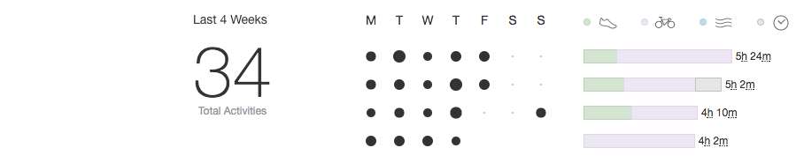
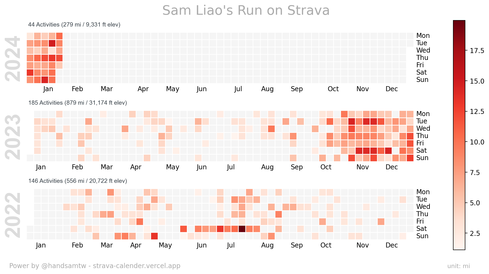
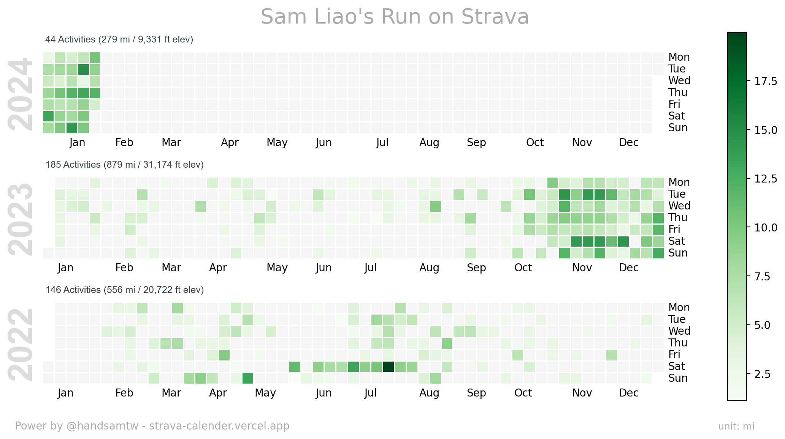
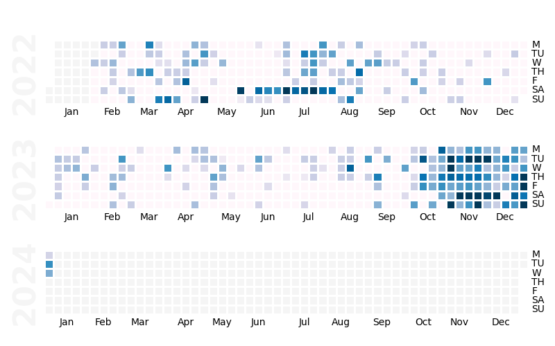

# Strava Calendar

<em>All your Strava workout in one image</em>

## Why do I build this project?

I'm a passionate road runner, an avid Strava user, and a software engineer. One day, I stumbled upon the [GitHub Contributions Chart Generator](https://github.com/sallar/github-contributions-chart) which crafts beautiful images displaying GitHub contributions. Simultaneously, I discovered [spotify-github-profile](https://github.com/kittinan/spotify-github-profile), a tool that generates Spotify 'now playing' cards on GitHub profiles.

This sparked an idea to blend these concepts and develop an application that summarizes my Strava activities, generating a heatmap image for display on my GitHub profile.

Initially, I tend to mirror the workflow of spotify-github-profile, by prompting users to authorize the app the read access of their Strava data and return an image endpoint that users can add `` to their README.md.

However, considering a wider audience who may prefer copying or downloading the image, creating a user-friendly interface similar to the GitHub Contributions Chart seems beneficial. Thus, the tone of this project is set.

## What problem does it solve?

While Strava offers members the ability to track their monthly and annually progress, this access is restricted to premium members who must pay $80/year. Moreover, the display format and color scheme are confined to the image below.

The application offers diverse heatmap views of Strava activity and presents an opportunity for free users to share their results on social media without the constraints of being paid users.

### Example

**Default scheme**

**Forest scheme**

**Aurora scheme**

There are a total of seven color scheme available for selection.

## Tech Stack

### Deployment

- **Vercel**
  - Vercel is an all-in-one platform
    featuring Global CDNs, facilitating application deployment and delivery. While Vercel excels in supporting Next.js, its capabilities extend beyond deploying Next.js applications alone. It offers a diverse range of framework templates, enabling me to effortlessly deploy my Angular application with just a few clicks.

### Database

- **MongoDB Atlas**

  - The database adheres to a strict policy of not storing any user-identifiable data. It exclusively retains short-lived access tokens, refresh tokens, token expiration timestamps, and temporary image files, all subject to permission granting.

### Backend API

- **[strava-calendar-api](https://github.com/handsamtw/strava-calender-api)**
  - Built with Python Flask framework deployed on Vercel. Strongly recommended to walk through that repo if you want to contribute to the project

### Third-Party dependencies

- **[Strava API V3](https://developers.strava.com/docs/reference/)**
  - The logic is housed within the strava-calendar-api. There's no direct communication between the frontend and the Strava API

### CI/CD

- Currently in the planning phase with an intent to utilize Circle CI or Github Action.

## Table of Contents

- [How to interact with the the application](#how-to-interact-with-the-the-application)
- [Running for development locally](#running-for-development-locally)
- [How to Contribute](#how-to-contribute)
- [Features in Progress](#features-in-progress)

### How to interact with the the application

Visit
[Strava Calendar Chart Generator](strava-calender.vercel.app) and click `Connect with Strava` button to grant permission

### Running for development locally

Modifying the frontend application solely for UI adjustments without involving real Strava data is straightforward. However, for testing the functionality, developers must navigate through the comprehensive setup of the [backend API repository](https://github.com/handsamtw/strava-calender-api). This includes configuring the database connection and interacting with the Strava API, which is necessary for local ececution of backend server.

How to run the frontend locally

- A fork of this project as your repository
- Clone the forked repo, and cd to project's root director
- Make sure you have Angular CLI install in your development environment
- Run `ng serve` and you suppose to be able to access http://localhost:4200
- (Opt.) A compreehensive setup of [backend API repository](https://github.com/handsamtw/strava-calender-api)
- (Opt.) Running the backend server while developing the frontend

### How to Contribute

### Features in Progress

### What I have learned?
