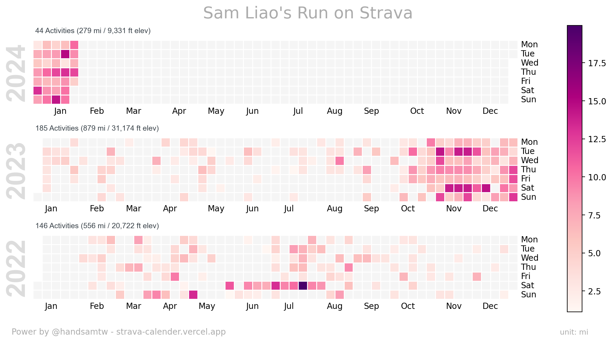
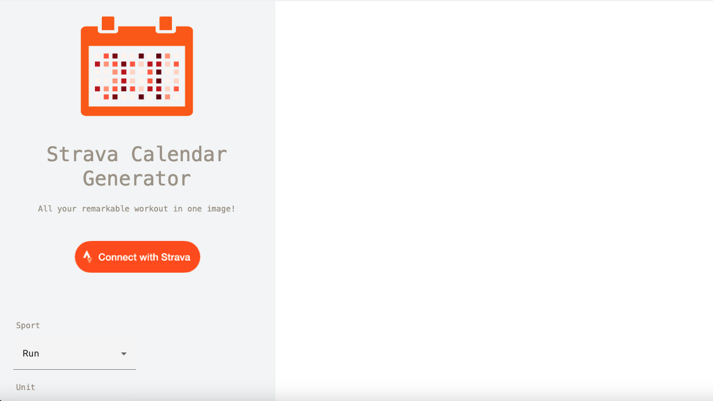
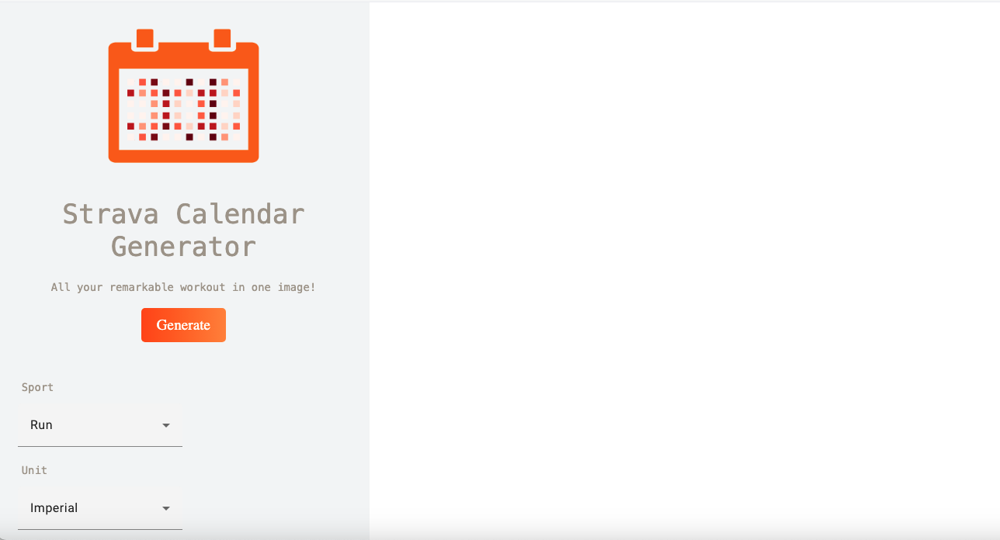
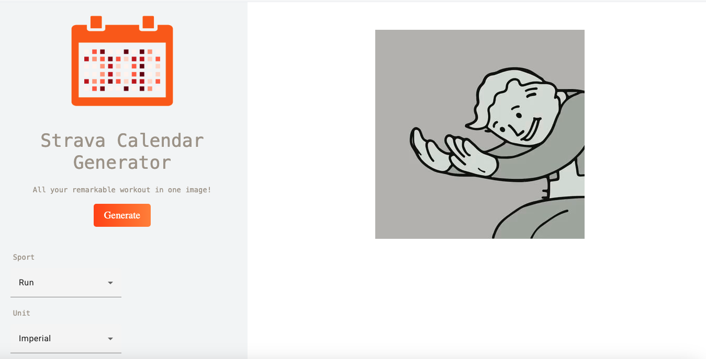
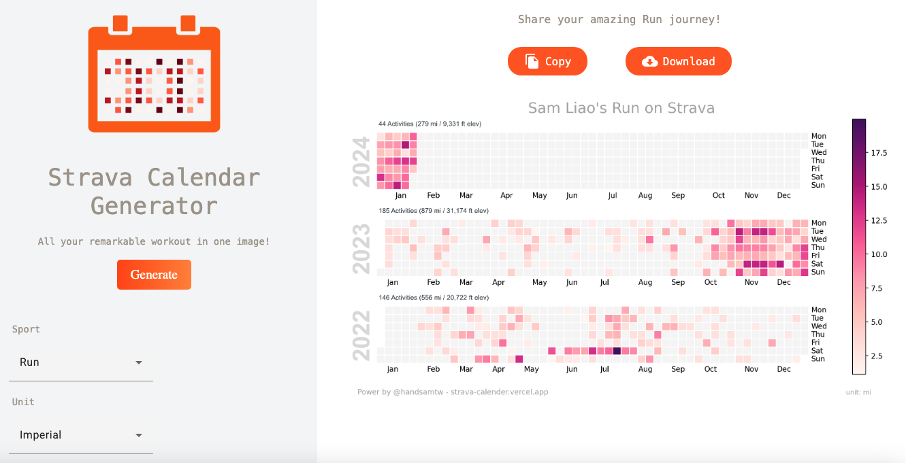

# Strava Calendar

<em>All your Strava workout in one image</em>

## Why do I build this project?

Being both a dedicated road runner and an enthusiastic Strava user, I've often wished for an appealing image of my Strava workouts to share on social media. One day, I stumbled upon the [GitHub Contributions Chart Generator](https://github.com/sallar/github-contributions-chart) which crafts beautiful images displaying GitHub contributions.

This sparked an idea to blend these concepts and develop an application that summarizes my Strava activities, generating a heatmap image.

## What problem does it solve?

While Strava offers members the ability to track their monthly and annually progress, this access is restricted to premium members who must pay $80/year. Moreover, the display format and color scheme are confined to the image below.

The application offers diverse heatmap views of Strava activity and presents an opportunity for free users to share their results on social media without the constraints of being paid users.

### Example

**Default scheme**

**Forest scheme**

**Spring scheme**

There are a total of seven color scheme available for selection.

## Tech Stack

### Deployment

- **Vercel**
  - Vercel is an all-in-one platform
    featuring Global CDNs, facilitating application deployment and delivery. While Vercel excels in supporting Next.js, its capabilities enable me to effortlessly deploy my Angular application with just a few clicks.

### Database

- **MongoDB Atlas**

  - The database adheres to a strict policy of not storing any user-identifiable data. It exclusively retains short-lived access tokens, refresh tokens, token expiration timestamps, all subject to permission granting.

### Backend API

- **[strava-calendar-api](https://github.com/handsamtw/strava-calender-api)**
  - Built with Python Flask framework deployed on Vercel. Strongly recommended to walk through that repo because it is the secret souce of the image generation flow.

### Third-Party dependencies

- **[Strava API V3](https://developers.strava.com/docs/reference/)**
  - The logic is housed within the strava-calendar-api. There's no direct communication between the frontend and the Strava API

### CI/CD

- Currently in the planning phase with an intent to utilize Circle CI or Github Action.

## Table of Contents

- [How to interact with the the application](#how-to-interact-with-the-the-application)
- [Running for development locally](#running-for-development-locally)
- [How to Contribute](#how-to-contribute)
- [Features in Progress](#features-in-progress)

### How to interact with the the application

1. Visit
   [Strava Calendar Chart Generator](strava-calender.vercel.app) and click `Connect with Strava` button to grant permission

   

2. After the authorization, users will redirected to
   home page. Since the uid and access_token is generated by backend API, user can now choose their preference setup and click `Generate` button

    

3. It will take longer for the first fetch, but the following request will be only roughly half of the time as the activity data is cached for 10 minutes.

   
      
   

### Running for development locally

How to run the frontend locally

- A fork of this project as your repository
- Clone the forked repo, and cd to project's root director
- Make sure you have Angular CLI install in your development environment
- Run `npm install`, it might take a long time, so feel free to setup [backend API repository](https://github.com/handsamtw/strava-calender-api) at the same time.
- Run `ng serve` and you suppose to be able to access http://localhost:4200
- (Opt.) You might need to adjust your node version to greater that node 17 to make Angular CLI version compatible.
- (Opt.) A compreehensive setup of [backend API repository](https://github.com/handsamtw/strava-calender-api)
- (Opt.) Running the backend server while developing the frontend
